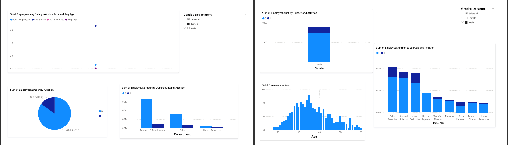

# Employee Attrition Analysis & Prediction

## Project Overview
This project focuses on analyzing employee attrition using data analytics and machine learning techniques. The goal is to identify key factors driving employee turnover and provide actionable insights to improve retention strategies.

## Business Problem
Employee attrition leads to increased costs, reduced productivity, and loss of talent. This project aims to answer:
- Why do employees leave?
- Which employees are at high risk?
- How can organizations reduce attrition?

## Tools & Technologies
- Python (Pandas, NumPy, Seaborn)
- Machine Learning (Logistic Regression)
- SQL
- Power BI

## Key Insights
- Employees with lower salaries are significantly more likely to leave
- Overtime is a strong predictor of attrition
- Job satisfaction plays a critical role in retention
- Younger employees (25–35) show higher turnover rates

## Dashboard
The Power BI dashboard provides:
- Workforce overview
- Attrition trends
- Key drivers of attrition
- Actionable business insights

## Project Structure
- data/ → dataset
- notebook/ → analysis & model
- dashboard/ → Power BI dashboard
- images/ → dashboard visuals

## Conclusion
This project demonstrates how data-driven decision-making can help organizations proactively reduce employee attrition and improve workforce management.

